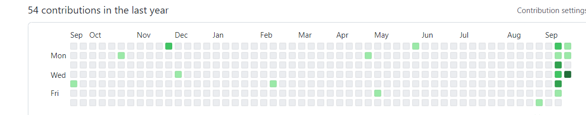

# GitHub auto-commits


<br>

<p align="center">
  
</p>


<br>

一个较为疯狂的想法,
<br>auto-commits 每天自动提交微博早上10点与晚上10点的微博热点标题:

```
time:2022-09-22 10:09:50.339049
Popular first:甘宇多处骨折并伴有严重感染
```

这是一个在linux服务器上服务器运行的脚本

<br><br>

> But [@orrsrosx-nonloso](https://github.com/orrsrosx-nonloso),
> <br>此脚本每天都会运行


<br><br>

## Getting Started

如果你想要在windows中使用,
<br>[设置适用于 Linux 的 Windows 子系统](https://docs.microsoft.com/en-us/windows/wsl/install-win10)

如果你还没有安装git,点击安装
<br>[git](https://github.com/git-guides/install-git)

<br>

1. 开启命令行
<br>& 并导航到您喜欢的任何文件夹

2. [Fork this project](https://github.com/orrsrosx-nonloso/auto-commits) on GitHub
  可以顺手给我一个star

2. 下载此项目的新副本

```shell
git clone https://github.com/<your-github-username>auto-commits.git
```

**不要忘记包含你的用户名**

3. 测试运行脚本
<br>以防您需要修复权限问题

```shell
/bin/bash ./auto-commits/bot.sh
```

4. 打开您的 crontab以设置定时触发器

```shell
crontab -e
```

> NOTE:
> <br>注意：
> <br>如果这使你的屏幕几乎是空白的，没有工具栏可以导航，
> <br>你可能已经进入了文本编辑器 Vim

> <br>记住，按“i”开始[i]插入文本

> <br>当你完成后，
> <br>重复按“Esc”直到什么都没有发生

> <br>然后输入 ":wq" 保存并退出
> <br>或 ":q!" 不保存就退出

5. [添加此行以安排每晚上 10 点或任何时间](https://crontab.guru/#0_22_*_*_*)

```shell
0 22 * * * /bin/bash /<full-path-to-your-folder>/auto-commits/bot.sh
```

**不要忘记包含正确的文件夹路径**

> NOTE:
> <br>确保在退出时保存更改
